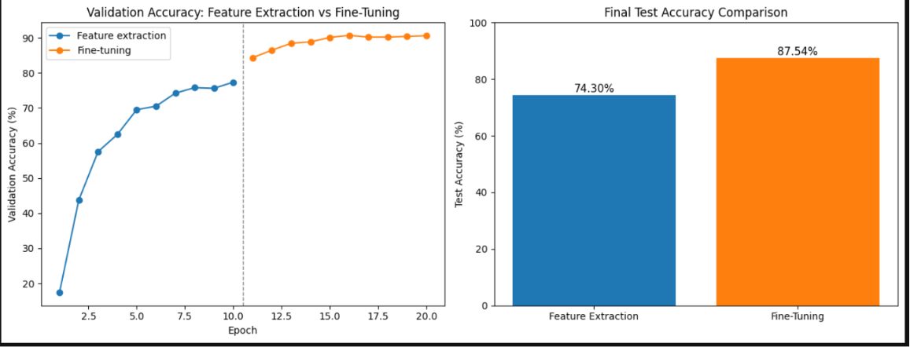
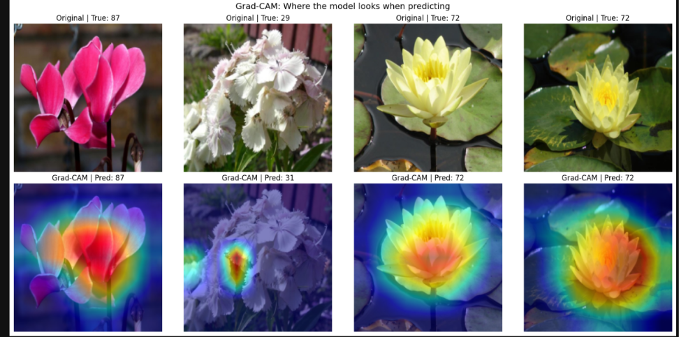
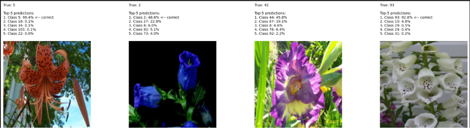
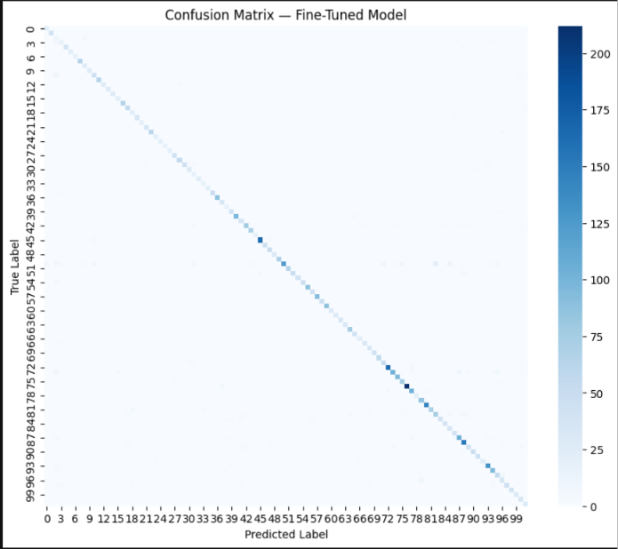

# Flower Classification using Transfer Learning (ResNet18)

Image classification project that identifies 102 different flower species from the **Oxford Flowers 102** dataset using **transfer learning** with a pretrained ResNet18 model. The project covers a full pipeline: data preprocessing, feature extraction, fine-tuning, evaluation, and model explainability.

## Overview

- **Dataset:** [Oxford Flowers 102](https://www.robots.ox.ac.uk/~vgg/data/flowers/102/) (102 flower categories, loaded via `torchvision.datasets`)
- **Model:** ResNet18, pretrained on ImageNet
- **Approach:** Feature extraction followed by fine-tuning
- **Framework:** PyTorch

## Results

| Stage | Test Accuracy |
|---|---|
| Feature Extraction (frozen backbone) | 73.96% |
| Fine-Tuning (unfrozen layer3/layer4) | **86.65%** |
| Improvement | +12.68 points |



## Project Pipeline

1. **Data pipeline** — resize to 224x224, normalize using ImageNet mean/std, augment training data with random flips and rotations
2. **Feature extraction** — freeze the entire pretrained ResNet18 backbone, replace and train only the final classifier layer for 102 classes
3. **Fine-tuning** — unfreeze the deeper backbone layers (`layer3`, `layer4`) and continue training with a lower learning rate, allowing the model to learn flower-specific features
4. **Evaluation** — compare test accuracy between both stages, visualize results with a confusion matrix
5. **Explainability** — Grad-CAM heatmaps to visualize which parts of an image the model focuses on, and top-5 predictions with confidence scores to see how certain the model is

## Why Fine-Tuning Improved Accuracy

Feature extraction only trains a new classifier on top of frozen, generic ImageNet features. Fine-tuning unfreezes the deeper backbone layers so they can adapt to flower-specific visual patterns (petal texture, shape, color combinations), which is why accuracy improved significantly over feature extraction alone.

## Model Explainability

**Grad-CAM** highlights the regions of an image the model used to make its prediction, confirming it focuses on the flower itself rather than the background.



**Top-5 predictions** show the model's confidence across its top 5 guesses instead of just the single best answer, revealing when the model is confusing visually similar flower species.



## Confusion Matrix



## Tech Stack

- Python
- PyTorch, Torchvision
- scikit-learn (confusion matrix, classification report)
- Matplotlib, Seaborn (visualization)
- OpenCV (Grad-CAM heatmap overlay)

## Project Structure

```
├── transfer_learning_final.ipynb   # Main notebook: full pipeline end-to-end
├── images/                         # Saved output graphs and screenshots
├── README.md
└── requirements.txt
```

## How to Run

1. Clone this repository
   ```
   git clone https://github.com/<your-username>/<your-repo-name>.git
   cd <your-repo-name>
   ```
2. Install dependencies
   ```
   pip install -r requirements.txt
   ```
3. Open and run the notebook
   ```
   jupyter notebook transfer_learning_final.ipynb
   ```

The Oxford Flowers 102 dataset downloads automatically on first run via `torchvision.datasets.Flowers102(download=True)`.

## Key Learnings

- How to apply transfer learning using a pretrained CNN for a custom classification task
- The difference between feature extraction and fine-tuning, and when each is appropriate
- Why learning rate matters when fine-tuning pretrained weights
- How to evaluate a model beyond a single accuracy number — using confusion matrices, per-class analysis, and explainability tools like Grad-CAM


## Author

   Shubham Makkar — [LinkedIn](https://www.linkedin.com/in/shubham-makkar-460577332) · [GitHub](https://github.com/Shubham09122005)
